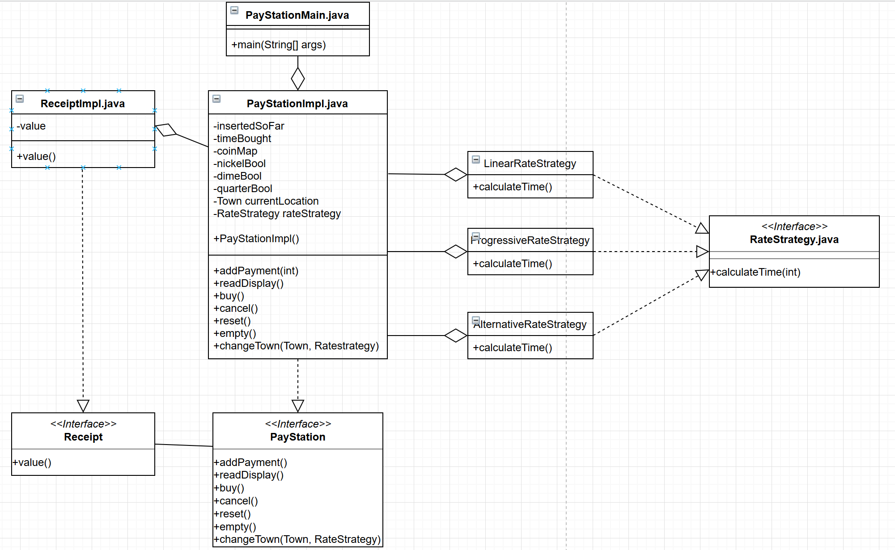

Christopher Park
Noah Costello

## Purpose
For this project, we are using a standardized code project from the previous paystation
project and implementing a main class so that a user can interact with the project.
To start this project, we imported the given code into a private repository
and protected the master branch so that peer reviews are required to merge
to master.

While creating the main method, there are a number of features that we need to
implement. First, we need a way of accepting nickels, dimes, and quarters for payment. 
Next, we need a way to convert these payments into time which is then displayed.
When using the buy function, these times should also be printed onto receipts. 
Whent the cancel function is used, the coin values and quantities are printed.
Lastly, we need to implement three different rate strategies for converting 
input coin value into time, and a means of swapping between the three.

In our version of the project, we opted for a compositional design. The main
issue presented for this project was the means by which the user could swap
between towns and their related rate strategies. In our implementation,
we have create an object of the PayStationImpl that stores a town and rate
strategy, but uses a method to edit those them. 

In the repo, there is a PayStationUML file (not the .PNG one). This is an editable
file that can be downloaded and modified using [draw.io](https://www.draw.io/).
This has been added so that changes to the design of the project can easily be 
updated rather than created from scratch each time.

## Contributions
Chris: created Readme file and UML diagram, created outline for main file,
designed Impl object.

Noah: filled while() loop, cleaned and bug fixed code, created new
unit tests, tested final product.

## Testing
There were already some implemented unit tests included in the standardized
repo that was supplied to us, however Noah did add some additional tests.
Beyond that, the majority of the testing was done manually to verify that
the input reading was properly doing its job and that called methods 
are responding as intended.

The most notable problem found from the standardized code was that the 
illegal coin exception was not properly set up under addPayment(). We
went and restructured that method to properly try/catch with the 
given exception.
